```mermaid
graph TD
    A[Start: Customer on Product Showcase Page] --> B{Type in Search Bar};
    B --> C[System: Filter Product Grid based on Title Match];
    C --> D{Matching Products Found?};
    D -- Yes --> E[Update Grid: Show only matching products];
    D -- No --> F[Update Grid: Show 'No products found' message];
    E --> B;
    F --> B;
    B -- Clear Search --> G[Update Grid: Show all products];
    G --> B;
```

# AI Chat-Web Platform Prototype UI/UX Specification

## Introduction

This document defines the user experience goals, information architecture, user flows, and visual design specifications for AI Chat-Web Platform Prototype's user interface. It serves as the foundation for visual design and frontend development, ensuring a cohesive and user-centered experience.

### Overall UX Goals & Principles

* **Target User Personas:**
    * **Business Owner:** Non-technical individuals in Bangladesh running small to large businesses primarily via Facebook/WhatsApp. Needs extreme simplicity in managing products.
    * **End Customer:** Users browsing the owner's products on the web or interacting via Messenger. Needs a clean, familiar, easy-to-navigate showcase.
* **Usability Goals:**
    * **Ease of learning (Owner):** The owner should be able to list their first product within minutes without instructions.
    * **Efficiency of use (Owner):** Adding new products should be quick and require minimal steps.
    * **Clarity (Customer):** Product information (Image, Title, Price) must be clearly displayed.
    * **Findability (Customer):** Customers should be able to easily find products via browsing the grid or using the title search.
* **Design Principles:**
    1.  **Simplicity First:** Prioritize ease of use over complex features, especially for the owner.
    2.  **Clarity:** Ensure information is presented clearly and unambiguously.
    3.  **Familiarity:** Use common e-commerce patterns (like the grid layout) so customers feel comfortable.
    4.  **Responsiveness:** The design must work well on mobile devices.
    5.  **Accessibility:** Aim for WCAG AA compliance.

### Change Log
| Date         | Version | Description                   | Author      |
| :----------- | :------ | :---------------------------- | :---------- |
| Oct 22, 2025 | 1.0     | Initial Spec draft creation | Sally (UX)  |

---

## Information Architecture (IA)

### Site Map / Screen Inventory
```mermaid
graph TD
    subgraph Owner (Admin Area)
        A[Admin Login] --> B(Product Dashboard);
        B -- Add Product --> C{Add Product Form/Modal};
    end

    subgraph Customer (Public Area)
        D[Product Showcase (Subdomain)] --> E[Product Detail Page];
        D -- Search --> D;
    end

    C -- Save --> B;
    E -- Back --> D;
````

### Navigation Structure

  * **Primary Navigation (Public):** Minimal. Likely just the business name/logo linking back to the showcase homepage.
  * **Primary Navigation (Admin):** Minimal. May include "Products" and "Logout".
  * **Secondary Navigation:** None anticipated for the prototype.
  * **Breadcrumb Strategy:** Not necessary for this simple structure.

-----

## User Flows

### Add New Product Flow

**User Goal:** For the business owner to easily add a new product (Title, Price, Image) to their showcase.

**Entry Points:** The "Product Dashboard" screen within the Admin Area.

**Success Criteria:** A new product record is successfully created in the database, and the owner receives confirmation.

**Flow Diagram:**

```mermaid
graph TD
    A[Start: Owner on Product Dashboard] --> B{Click 'Add New Product' button};
    B --> C[Show Simple Product Form (Title, Price, Image Upload)];
    C --> D{Fill in Title};
    D --> E{Fill in Price};
    E --> F{Upload Image};
    F --> G{All fields valid?};
    G -- Yes --> H[Enable 'Save' button];
    G -- No --> C;
    H --> I{Click 'Save' button};
    I --> J[System: Upload Image to storage];
    J --> K[System: Save Product (Title, Price, ImageURL) to DB];
    K --> L[Show Success Message];
    L --> M[End: Return to Product Dashboard / Clear Form];
    I -- Error --> N[Show Error Message];
    N --> C;
```

**Edge Cases & Error Handling:**

  * What happens if image upload fails? (Should show an error, prevent saving).
  * What happens if database save fails? (Should show an error).
  * Input validation (e.g., price should be a number).

**Notes:** This flow must be extremely simple and intuitive for the non-technical owner, as per NFR1. The form could be a modal overlay or a separate page.

### Customer Product Search Flow

**User Goal:** For the end customer to quickly filter the product grid and find a specific product by its name.

**Entry Points:** The "Product Showcase" page (subdomain).

**Success Criteria:** The product grid updates in real-time to show only products whose titles match the search term.

**Flow Diagram:**



**Edge Cases & Error Handling:**

  * Search performance with a large number of products (though less critical for a prototype).
  * Handling of special characters or different languages in search terms (defer for prototype).

**Notes:** This interaction should feel instant (real-time filtering as the user types). The filtering logic is strictly based on the **Product Title**.

-----

## Wireframes & Mockups

**Primary Design Files:** (Assumption: We will use Figma for detailed mockups and prototypes, but this needs confirmation).

### Key Screen Layouts

#### Admin View (Owner): Product Dashboard

  * **Purpose:** Allow the owner to see their products and access the 'Add Product' function.
  * **Key Elements:**
      * Header (Minimal: maybe just Business Name).
      * **'Add New Product' Button** (Prominently displayed).
      * A simple list or grid showing existing products (Image, Title, Price) - enough to identify them. (Note: Editing/Deleting is out of scope for now).
  * **Interaction Notes:** Clicking 'Add New Product' triggers the form/modal.
  * **Design File Reference:** [Link to specific Figma frame TBD]

#### Admin View (Owner): Add Product Form/Modal

  * **Purpose:** Provide the simple 3-field form for adding a product.
  * **Key Elements:**
      * **Product Title** input field (Text).
      * **Product Price** input field (Text/Number).
      * **Product Image** upload button/area.
      * **'Save' Button** (Initially disabled).
      * 'Cancel' or 'Close' button.
  * **Interaction Notes:** 'Save' enabled only when all fields are valid. Success/Error messages shown after attempting save.
  * **Design File Reference:** [Link to specific Figma frame TBD]

#### Public View (Customer): Product Showcase

  * **Purpose:** Display products in a grid and allow searching.
  * **Key Elements:**
      * Header (Minimal: Business Name/Logo).
      * **Search Bar** (Prominently at the top).
      * **Product Grid** (Responsive: e.g., 2 columns on mobile, 3-4 on desktop) displaying Image, Title, Price for each item.
      * Placeholder text/image if no products exist.
      * 'No products found' message area for search results.
  * **Interaction Notes:** Typing in search filters the grid in real-time. Clicking a product item navigates to the Product Detail Page.
  * **Design File Reference:** [Link to specific Figma frame TBD]

#### Public View (Customer): Product Detail Page

  * **Purpose:** Show details for a single product (Assumption based on PRD chatbot links).
  * **Key Elements:**
      * Header (Consistent with Showcase).
      * Larger Product **Image**.
      * Product **Title**.
      * Product **Price**.
      * (Optional but recommended: Simple 'Back' link to Showcase).
  * **Interaction Notes:** This is primarily a display page for the prototype. No purchase action needed here based on chatbot flow.
  * **Design File Reference:** [Link to specific Figma frame TBD]

-----

## Component Library / Design System

**Design System Approach:** (Assumption: Given the prototype nature and focus on speed, we will leverage a pre-built component library compatible with the chosen framework (React/Next.js). Using a library like Material UI, Chakra UI, or even simple Tailwind UI components will accelerate development and ensure consistency without needing to build basic elements like buttons or forms from scratch).

### Core Components

#### Product Card

  * **Purpose:** To display a single product (Image, Title, Price) within the Product Showcase grid.
  * **Variants:** Standard display card.
  * **States:** Default state. (Hover effects could be added if time permits).
  * **Usage Guidelines:** Used within the responsive grid on the main showcase page. Clicking the card should navigate to the Product Detail Page.

-----

## Branding & Style Guide

### Visual Identity

  * **Brand Guidelines:** N/A for prototype. Will use a clean, neutral template.

### Color Palette

(Assumption: We'll use a simple, modern palette focusing on clarity and accessibility. Specific hex codes TBD during design/development).
| Color Type  | Hex Code | Usage                                           |
| :---------- | :------- | :---------------------------------------------- |
| Primary     | TBD      | Buttons, active states, key actions             |
| Secondary   | TBD      | Secondary actions, supporting elements        |
| Accent      | TBD      | Highlights, calls-to-action                     |
| Success     | TBD      | Positive feedback, confirmations              |
| Warning     | TBD      | Cautions, important notices                   |
| Error       | TBD      | Errors, destructive actions                   |
| Neutral     | TBD      | Text (various shades), borders, backgrounds |

### Typography

#### Font Families

  * **(Assumption:** Use system default fonts for simplicity and performance).
  * **Primary:** System UI (e.g., San Francisco, Roboto, Segoe UI)
  * **Secondary:** N/A
  * **Monospace:** System Monospace (e.g., Menlo, Consolas)

#### Type Scale

(Assumption: Standard, accessible type scale TBD during design/development).
| Element | Size | Weight | Line Height |
| :------ | :--- | :----- | :---------- |
| H1      | TBD  | TBD    | TBD         |
| H2      | TBD  | TBD    | TBD         |
| H3      | TBD  | TBD    | TBD         |
| Body    | TBD  | TBD    | TBD         |
| Small   | TBD  | TBD    | TBD         |

### Iconography

  * **(Assumption:** Use a standard, open-source icon library like Material Icons or Font Awesome for any necessary icons (e.g., search icon, add icon)).
  * **Icon Library:** TBD (e.g., Material Icons)
  * **Usage Guidelines:** Use minimally and consistently.

### Spacing & Layout

  * **(Assumption:** Use a standard 8px grid system and spacing scale for consistency).
  * **Grid System:** 8px grid
  * **Spacing Scale:** TBD (e.g., 4px, 8px, 12px, 16px, 24px, 32px...)

-----

## Accessibility Requirements

### Compliance Target

  * **Standard:** WCAG 2.1 Level AA

### Key Requirements

  * **Visual:**
      * Color contrast ratios: Must meet WCAG AA requirements (4.5:1 for normal text, 3:1 for large text).
      * Focus indicators: All interactive elements must have a clear visual focus indicator.
      * Text sizing: Users should be able to resize text up to 200% without loss of content or functionality.
  * **Interaction:**
      * Keyboard navigation: All interactive elements must be reachable and operable via keyboard alone.
      * Screen reader support: Use semantic HTML to ensure compatibility with screen readers.
      * Touch targets: Ensure adequate size and spacing for touch targets on mobile devices.
  * **Content:**
      * Alternative text: All informative images (like product images) must have appropriate alt text. (Owner-provided images might be a challenge).
      * Heading structure: Use proper heading levels (H1, H2, H3...) for page structure.
      * Form labels: All form fields must have clear, programmatically associated labels.

### Testing Strategy

  * **(Assumption:** Basic automated checks (e.g., using browser extensions like Axe) and manual keyboard navigation testing will be performed during development).
  * **Testing:** Automated checks + Manual keyboard testing.

-----

## Responsiveness Strategy

### Breakpoints

(Assumption: We'll use standard device breakpoints. Exact pixel values can be adjusted based on the chosen component library or CSS framework).
| Breakpoint | Min Width | Max Width | Target Devices        |
| :--------- | :-------- | :-------- | :-------------------- |
| Mobile     | 0px       | \~767px    | Smartphones           |
| Tablet     | \~768px    | \~1023px   | Tablets               |
| Desktop    | \~1024px   | \~1439px   | Laptops, Desktops     |
| Wide       | \~1440px   | -         | Large Desktop Monitors|

### Adaptation Patterns

  * **Layout Changes:**
      * The **Product Grid** will adjust the number of columns (e.g., 2 on mobile, 3 on tablet, 4+ on desktop).
      * The **Admin Dashboard** might stack elements vertically on mobile.
  * **Navigation Changes:** Minimal navigation is planned, so changes will be minor (likely none needed for the prototype).
  * **Content Priority:** Ensure key elements like the **Search Bar** and **Add New Product** button are easily accessible on mobile. Product image, title, and price must remain visible.
  * **Interaction Changes:** Touch target sizes will be considered for mobile usability.

-----

## Animation & Micro-interactions

### Motion Principles

  * **(Assumption:** Animations should be subtle, quick, and meaningful, providing feedback without being distracting. Focus on standard transitions like fades or slides).

### Key Animations

  * **(Assumption:** Define minimal animations for core interactions).
      * **Button Feedback:** Subtle press/hover states on buttons like 'Add New Product' and 'Save'.
      * **Search Filter:** A smooth transition (e.g., fade in/out) as the product grid updates during search.
      * **Form Validation:** Clear visual cues (e.g., color change) for input validation errors on the 'Add Product' form.

-----

## Performance Considerations

### Performance Goals

*(Assumption: Set achievable goals for a prototype).*

  * **Page Load:** Aim for First Contentful Paint (FCP) under 2 seconds on a simulated average mobile connection.
  * **Interaction Response:** Search filtering and form submissions should feel near-instant (\<500ms).
  * **Animation FPS:** Animations should maintain a smooth frame rate (aiming for 60 FPS).

### Design Strategies

*(Assumption: Define basic strategies).*

  * **Image Optimization:** Owner-uploaded images should be reasonably compressed and potentially served in modern formats (like WebP) if feasible for the prototype. Lazy loading images below the fold should be considered.
  * **Code Splitting:** Leverage framework features (like Next.js) for automatic code splitting per page.
  * **Minimize Heavy Libraries:** Be mindful of adding large dependencies that could slow down load times.

-----

