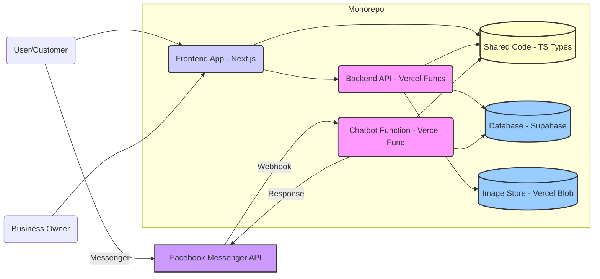
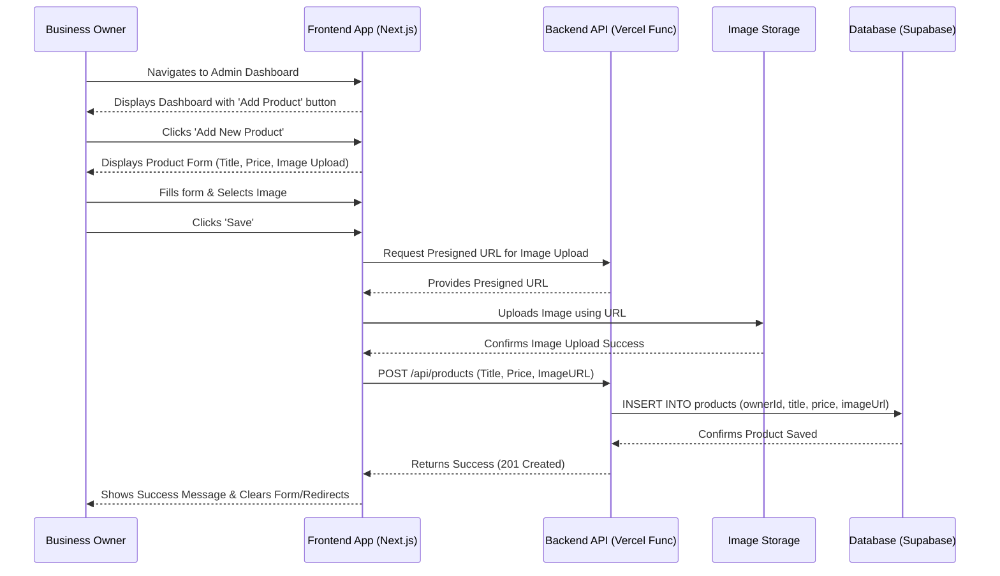
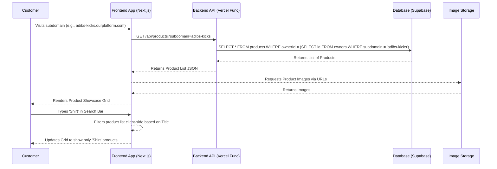
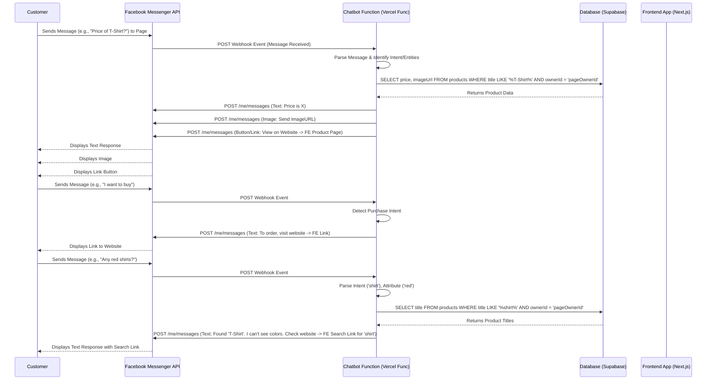
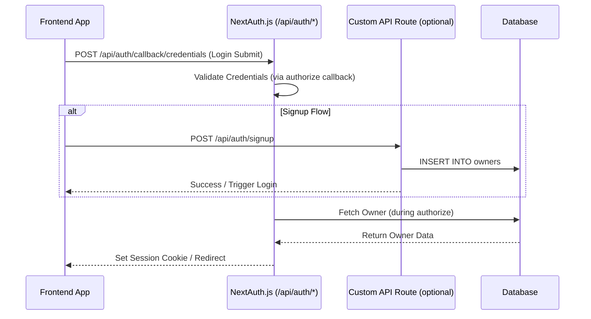
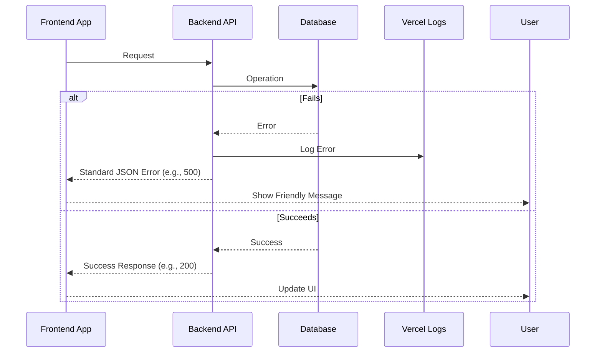

# AI Chat-Web Platform Prototype Fullstack Architecture Document

## Introduction

This document outlines the complete fullstack architecture for the AI Chat-Web Platform Prototype, including backend systems (serverless functions), frontend implementation (React/Next.js website), and their integration, specifically including the Facebook Messenger chatbot. It serves as the single source of truth for AI-driven development, ensuring consistency across the entire technology stack. This unified approach combines backend and frontend architecture concerns, streamlining development for this modern fullstack application.

### Starter Template or Existing Project
* The PRD specifies using React (specifically Next.js) for the frontend and Node.js for the serverless backend, within a monorepo structure.
* Assumption: We will use `create-next-app` as a base within the monorepo, as no specific alternative starter was provided.

### Change Log
| Date         | Version | Description                   | Author        |
| :----------- | :------ | :---------------------------- | :------------ |
| Oct 22, 2025 | 1.0     | Initial Architecture draft    | Winston (Arch)|
|              |         |                               |               |

---

## High Level Architecture

### Technical Summary
This project employs a **serverless, fullstack architecture** designed for rapid prototyping and cost-efficiency, aligning with the competition goal. It utilizes a **React/Next.js frontend** hosted statically or server-rendered, communicating with **Node.js serverless functions** for backend logic (like product saving and chatbot responses). Data is stored in a simple, **serverless-friendly database** (e.g., Supabase PostgreSQL). Key integrations include image storage and the **Facebook Messenger API**. The entire system is structured within a **monorepo** for simplified code sharing and deployment. This architecture directly supports the goals of providing a simple website builder and an integrated chatbot.

### Platform and Infrastructure Choice
* **Recommendation:** **Vercel**.
* **Rationale:** Excellent Next.js support, built-in serverless functions, straightforward subdomain management potential, integrated workflow, generous free tier suitable for prototype.
* **Platform:** Vercel.
* **Key Services:** Vercel Hosting, Vercel Functions, Vercel Blob (or similar like Cloudinary/AWS S3 for image storage).
* **Deployment Host and Regions:** Vercel Global Edge Network.

### Repository Structure
* **Structure:** Monorepo.
* **Monorepo Tool:** npm workspaces (or pnpm/yarn workspaces).
* **Package Organization:** Use a standard structure like `apps/` (for `web` frontend, `chatbot` backend) and `packages/` (for `shared` types/code).

### High Level Architecture Diagram

```mermaid
graph TD
    subgraph Browser
        U[User/Customer] --> FE[Next.js Frontend on Vercel];
    end

    subgraph Facebook Messenger
        C[Customer] <-- Msgs --> FB[Facebook Messenger API];
    end

    subgraph Vercel Platform
        FE -- API Calls --> API[Vercel Functions (Node.js)];
        API -- DB Ops --> DB[(Serverless DB e.g., Supabase)];
        API -- Img Ops --> Store[Image Storage (Vercel Blob / S3)];
        FB -- Webhook --> ChatFunc[Chatbot Vercel Function (Node.js)];
        ChatFunc -- DB Ops --> DB;
        ChatFunc -- Msgs --> FB;
    end

    subgraph Admin Area (Part of FE)
        Owner[Business Owner] --> AdminFE[Admin Dashboard in Next.js];
        AdminFE -- API Calls --> API;
    end

    FE -- Reads Images --> Store;
    AdminFE -- Uploads Images --> API;
````

### Architectural Patterns

  * **Jamstack/Serverless:** Using a statically generated or server-rendered frontend with serverless functions for dynamic backend logic. *Rationale:* Aligns with PRD for low cost, scalability, and rapid development.
  * **Component-Based UI:** Using React/Next.js components for the frontend. *Rationale:* Standard practice for React, promotes reusability and maintainability.
  * **API Layer (Serverless Functions):** Backend logic exposed via simple HTTP endpoints deployed as serverless functions. *Rationale:* Simple, scalable, fits the chosen platform.
  * **Webhook Integration:** Facebook Messenger integration via webhooks triggering a serverless function. *Rationale:* Standard pattern for chatbot integrations.

-----

## Tech Stack

### Technology Stack Table

| Category             | Technology         | Version   | Purpose                                     | Rationale                                                                        |
| :------------------- | :----------------- | :-------- | :------------------------------------------ | :------------------------------------------------------------------------------- |
| Frontend Language    | TypeScript         | \~5.x      | Primary FE language                         | Strong typing, aligns with modern React/Next.js practices         |
| Frontend Framework   | Next.js (React)    | \~14.x     | App framework (SSR, SSG, API routes)        | Matches PRD, excellent Vercel integration, good DX               |
| UI Component Library | **MUI** or **Chakra UI** | Latest    | Pre-built React components                  | Accelerates UI development, ensures consistency. Choice TBD. |
| State Management     | **React Context** | Latest    | Global state management                     | Simple, fits prototype scope. Can upgrade to Zustand if needed.   |
| Backend Language     | TypeScript         | \~5.x      | Primary BE language                         | Consistency with frontend, strong typing for serverless functions |
| Backend Framework    | **Next.js API Routes** | \~14.x     | Backend logic hosting                       | Integrated with Next.js, simplest for Vercel functions            |
| API Style            | REST               | N/A       | FE/BE communication                         | Simple, standard, well-supported by Next.js API routes.                          |
| Database             | **Supabase (PostgreSQL)** | Latest    | Primary data storage                        | Serverless-friendly, generous free tier, easy setup.               |
| Cache                | N/A                | N/A       | (Not needed for prototype)                  | Keep scope minimal.                                               |
| File Storage         | **Vercel Blob** | Latest    | Image uploads (Story 1.5)       | Integrated with chosen platform, simple API.                                  |
| Authentication       | **NextAuth.js** | \~5.x      | User signup/login (Story 1.2)    | Standard for Next.js, handles email/password & social logins easily.             |
| Frontend Testing     | Jest + RTL         | Latest    | Unit/Integration tests                      | Standard for React/Next.js, fulfills PRD "Unit Only".             |
| Backend Testing      | Jest               | Latest    | Unit tests for API routes/functions         | Consistent with frontend, fulfills PRD "Unit Only".               |
| E2E Testing          | N/A                | N/A       | (Out of scope for prototype testing)        | Keep scope minimal.                                               |
| Build Tool           | Next.js (built-in) | \~14.x     | Bundling, Compiling                         | Comes integrated with the framework.                                             |
| Bundler              | Webpack/Turbopack  | Latest    | (Handled by Next.js)                        | Comes integrated with the framework.                                             |
| IaC Tool             | N/A                | N/A       | (Vercel handles infrastructure via UI/CLI)  | Platform handles deployment infra implicitly.                                    |
| CI/CD                | Vercel             | N/A       | Automated builds & deployments              | Integrated with platform, simple Git push workflow.                              |
| Monitoring           | Vercel Analytics   | N/A       | Basic usage/performance monitoring          | Built-in to platform, sufficient for prototype.                                  |
| Logging              | Vercel Functions Logs | N/A       | Backend function logging                  | Built-in to platform, sufficient for prototype debugging.                        |
| CSS Framework        | **Tailwind CSS** | Latest    | Utility-first CSS                           | Integrates well with component libraries, speeds up styling.                     |

-----

## Data Models

### Owner

  * **Purpose:** Represents the business owner who signs up and manages products.

  * **Key Attributes:**

      * `id`: `UUID` - Unique identifier
      * `email`: `String` - Owner's login email
      * `hashedPassword`: `String` - For authentication
      * `businessName`: `String` - Used for display and subdomain generation
      * `subdomain`: `String` - Unique subdomain assigned to the owner
      * `facebookPageId`: `String` (Optional) - Linked Facebook Page ID for chatbot
      * `facebookPageToken`: `String` (Optional, Encrypted) - Secure token for Messenger API access

  * **TypeScript Interface:**

    ```typescript
    interface Owner {
      id: string; // UUID
      email: string;
      businessName: string;
      subdomain: string;
      facebookPageId?: string;
      // Note: hashedPassword and facebookPageToken are backend-only
    }
    ```

  * **Relationships:**

      * One Owner has many Products.

### Product

  * **Purpose:** Represents a product listed by a business owner.

  * **Key Attributes:**

      * `id`: `UUID` - Unique identifier
      * `ownerId`: `UUID` - Foreign key linking to the Owner
      * `title`: `String` - Product name
      * `price`: `String` - Product price (Using String for simplicity, validated via CHECK constraint)
      * `imageUrl`: `String` - URL of the uploaded product image

  * **TypeScript Interface:**

    ```typescript
    interface Product {
      id: string; // UUID
      ownerId: string; // UUID
      title: string;
      price: string; // Using String type
      imageUrl: string;
    }
    ```

  * **Relationships:**

      * Many Products belong to one Owner.

-----

## API Specification

### REST API Specification

```yaml
openapi: 3.0.0
info:
  title: AI Chat-Web Platform API
  version: 1.0.0
  description: API for managing products and owner accounts for the prototype.
servers:
  - url: /api # Assuming Next.js API routes base path
    description: Development server

paths:
  /auth/signup:
    post:
      summary: Register a new business owner (Story 1.2)
      requestBody:
        required: true
        content:
          application/json:
            schema:
              type: object
              properties:
                email:
                  type: string
                  format: email
                password:
                  type: string
      responses:
        '201':
          description: Owner created successfully
        '400':
          description: Invalid input or email already exists
  /auth/login:
    post:
      summary: Log in an existing business owner
      requestBody:
        required: true
        content:
          application/json:
            schema:
              type: object
              properties:
                email:
                  type: string
                  format: email
                password:
                  type: string
      responses:
        '200':
          description: Login successful (returns session token/cookie)
        '401':
          description: Unauthorized
  /owner/subdomain:
    post:
      summary: Set owner's business name and generate subdomain (Story 1.3)
      security:
        - cookieAuth: [] # Or appropriate auth scheme
      requestBody:
        required: true
        content:
          application/json:
            schema:
              type: object
              properties:
                businessName:
                  type: string
      responses:
        '200':
          description: Subdomain set successfully
          content:
            application/json:
              schema:
                type: object
                properties:
                  subdomain:
                    type: string
        '400':
          description: Invalid business name or subdomain already taken
        '401':
          description: Unauthorized
  /products:
    post:
      summary: Add a new product (Story 1.5)
      security:
        - cookieAuth: []
      requestBody:
        required: true
        content:
          # Assuming image upload is handled separately (e.g., via presigned URL)
          application/json:
            schema:
              type: object
              properties:
                title:
                  type: string
                price:
                  type: string # Using String based on previous discussion
                imageUrl:
                  type: string
                  format: url
      responses:
        '201':
          description: Product created successfully
        '400':
          description: Invalid input
        '401':
          description: Unauthorized
    get:
      summary: Get products for a specific owner/subdomain (Story 1.6)
      parameters:
        - name: subdomain
          in: query
          required: true
          schema:
            type: string
      responses:
        '200':
          description: List of products
          content:
            application/json:
              schema:
                type: array
                items:
                  $ref: '#/components/schemas/Product'
        '404':
          description: Subdomain/Owner not found

  # Chatbot webhook endpoint is separate (e.g., /api/webhook/messenger)

components:
  schemas:
    Product:
      type: object
      properties:
        id:
          type: string
          format: uuid
        ownerId:
          type: string
          format: uuid
        title:
          type: string
        price:
          type: string # Consistent with request body
        imageUrl:
          type: string
          format: url
  securitySchemes:
    cookieAuth: # Example using cookies via NextAuth.js
      type: apiKey
      in: cookie
      name: next-auth.session-token # Adjust name as needed
```

-----

## Components

### Component List

#### Frontend App (`apps/web`)

  * **Responsibility:** Handles all user-facing interactions (public showcase, owner admin dashboard). Renders UI, manages state, interacts with backend API. Built with Next.js.
  * **Key Interfaces:** Renders HTML, makes HTTP requests to `/api/*`.
  * **Dependencies:** Backend API, Shared Packages.
  * **Technology Stack:** Next.js, React, TypeScript, UI Library, Tailwind CSS, Zustand/Context, NextAuth.js.

#### Backend API (`apps/web/pages/api` or `apps/api`)

  * **Responsibility:** Handles business logic via serverless functions (auth, owner accounts, product CRUD, image upload coordination). Implemented as Next.js API Routes.
  * **Key Interfaces:** Exposes RESTful HTTP endpoints, interacts with DB and Image Storage.
  * **Dependencies:** Database, Image Storage, Shared Packages.
  * **Technology Stack:** Node.js, TypeScript, Next.js, Supabase Client.

#### Chatbot Function (`apps/web/pages/api/webhook/messenger.ts`)

  * **Responsibility:** Handles Facebook Messenger webhooks, parses messages, queries DB, sends responses. Implemented as a Vercel Function (via Next.js API Route).
  * **Key Interfaces:** Receives POST from Facebook, Sends POST to Messenger API, Interacts with DB.
  * **Dependencies:** Database, Facebook Messenger API, Shared Packages.
  * **Technology Stack:** Node.js, TypeScript, Facebook SDK/API client.

#### Database (`External Service - Supabase`)

  * **Responsibility:** Persists Owner and Product data. Enforces schema.
  * **Key Interfaces:** SQL interface (PostgreSQL).
  * **Dependencies:** None.
  * **Technology Stack:** PostgreSQL (via Supabase).

#### Image Storage (`External Service - Vercel Blob / Supabase Storage`)

  * **Responsibility:** Stores uploaded product images, provides URLs.
  * **Key Interfaces:** HTTP API for uploads/downloads.
  * **Dependencies:** None.
  * **Technology Stack:** Vercel Blob or Supabase Storage.

#### Shared Code (`packages/shared`)

  * **Responsibility:** Contains shared TypeScript types (`Owner`, `Product`).
  * **Key Interfaces:** Exports TypeScript types.
  * **Dependencies:** None.
  * **Technology Stack:** TypeScript.

### Component Diagrams



-----

## External APIs

### Facebook Messenger API

  * **Purpose:** Receive messages and send chatbot responses (Stories 2.1-2.4).
  * **Documentation:** [https://developers.facebook.com/docs/messenger-platform/](https://developers.facebook.com/docs/messenger-platform/)
  * **Base URL(s):** `https://graph.facebook.com/v<API_VERSION>/me/messages`.
  * **Authentication:** Page Access Token (obtained via OAuth, Story 2.1). Securely stored.
  * **Rate Limits:** Standard limits apply; unlikely issue for prototype.
  * **Key Endpoints Used:**
      * `POST /me/messages`: To send messages.
      * Webhook Endpoint (Our Chatbot Function): To receive messages.
  * **Integration Notes:** Requires Facebook App setup, webhook config, permissions request, verification. App approval may be needed.

-----

## Core Workflows

### Workflow 1: Owner Adds New Product (Stories 1.4, 1.5)



### Workflow 2: Customer Views Showcase & Searches (Stories 1.6, 1.7)



### Workflow 3: Customer Interacts with Chatbot (Stories 2.2, 2.3, 2.4)



-----

## Database Schema

```sql
-- Enable UUID extension if not already enabled (common in Supabase)
CREATE EXTENSION IF NOT EXISTS "uuid-ossp";

-- Table for Business Owners
CREATE TABLE owners (
    id UUID PRIMARY KEY DEFAULT uuid_generate_v4(),
    email TEXT UNIQUE NOT NULL,
    hashed_password TEXT NOT NULL, -- Ensure proper hashing is used by auth library
    business_name TEXT NOT NULL,
    subdomain TEXT UNIQUE NOT NULL,
    facebook_page_id TEXT, -- Store Page ID for linking
    -- Store encrypted token securely; consider a separate secrets manager long-term
    encrypted_facebook_page_token TEXT,
    created_at TIMESTAMPTZ DEFAULT now(),
    updated_at TIMESTAMPTZ DEFAULT now()
);

-- Table for Products listed by Owners
CREATE TABLE products (
    id UUID PRIMARY KEY DEFAULT uuid_generate_v4(),
    owner_id UUID NOT NULL REFERENCES owners(id) ON DELETE CASCADE,
    title TEXT NOT NULL,
    -- Using TEXT for price based on previous discussion, add CHECK constraint for validation
    price TEXT NOT NULL CHECK (price ~ '^\d+(\.\d{1,2})?$'), -- Simple check for positive number/decimal
    image_url TEXT NOT NULL, -- URL provided by Image Storage service
    created_at TIMESTAMPTZ DEFAULT now(),
    updated_at TIMESTAMPTZ DEFAULT now()
);

-- Indexes for performance
CREATE INDEX idx_owners_subdomain ON owners(subdomain);
CREATE INDEX idx_products_owner_id ON products(owner_id);
CREATE INDEX idx_products_title ON products(title); -- For title search (Story 1.7)

-- Optional: Trigger function to update 'updated_at' timestamps automatically
CREATE OR REPLACE FUNCTION trigger_set_timestamp()
RETURNS TRIGGER AS $$
BEGIN
  NEW.updated_at = NOW();
  RETURN NEW;
END;
$$ LANGUAGE plpgsql;

CREATE TRIGGER set_timestamp_owners
BEFORE UPDATE ON owners
FOR EACH ROW
EXECUTE FUNCTION trigger_set_timestamp();

CREATE TRIGGER set_timestamp_products
BEFORE UPDATE ON products
FOR EACH ROW
EXECUTE FUNCTION trigger_set_timestamp();

```

-----

## Frontend Architecture

### Component Architecture

#### Component Organization

Components organized by feature in `apps/web/src/components/`. Shared UI elements in `ui` sub-directory or `packages/ui`.

```text
apps/web/src/
├── components/
│   ├── ui/                 # Basic, reusable UI elements
│   ├── products/           # Product related components
│   │   ├── ProductGrid.tsx
│   │   ├── ProductCard.tsx   #
│   │   └── SearchBar.tsx     #
│   ├── owner/              # Admin dashboard components
│   │   ├── AddProductForm.tsx #
│   │   └── OwnerDashboard.tsx #
│   └── auth/               # Auth components
│       ├── LoginForm.tsx
│       └── SignupForm.tsx    #
└── ...
```

#### Component Template

Standard React functional components with TypeScript props. Use UI library components (MUI/Chakra).

```typescript
import React from 'react';
// Import UI library components

type MyComponentProps = { /* ... */ };

const MyComponent: React.FC<MyComponentProps> = (props) => {
  // ... state and effects ...
  return (
    {/* Use UI Library components */}
  );
};
export default MyComponent;
```

### State Management Architecture

#### State Structure

Start with **React Context** for global auth state. Manage feature state locally or lift state up.

```typescript
// Example: apps/web/src/context/AuthContext.tsx
import React, { createContext, useState, useContext, ReactNode } from 'react';
// ... AuthState, AuthContextProps ...
const AuthContext = createContext<AuthContextProps | undefined>(undefined);
export const AuthProvider = ({ children }: { children: ReactNode }) => { /* ... */ };
export const useAuth = () => { /* ... */ };
```

#### State Management Patterns

  * Use context hooks (`useAuth`).
  * Prefer local `useState`.
  * Consider server state libraries (React Query/SWR) later for API data caching.

### Routing Architecture

#### Route Organization

Use Next.js file-system router (`pages/` or `app/`).

```text
apps/web/src/
├── pages/ or app/
│   ├── index.tsx                 # Public showcase (dynamic)
│   ├── [subdomain]/index.tsx     # Dynamic route for showcase
│   ├── [subdomain]/product/[id].tsx # Product Detail Page
│   ├── admin/                    # Owner admin area (protected)
│   │   ├── index.tsx             # Product Dashboard
│   │   └── add-product.tsx     # Add Product Page
│   ├── auth/
│   │   ├── login.tsx
│   │   └── signup.tsx            #
│   └── api/                      # Backend API routes
└── ...
```

#### Protected Route Pattern

Use NextAuth.js middleware to protect `/admin/*` routes.

```typescript
// Example: apps/web/middleware.ts
export { auth as middleware } from "./auth"
export const config = { matcher: ["/admin/:path*"] };
```

### Frontend Services Layer

#### API Client Setup

Use `axios` wrapper configured for base URL and interceptors.

```typescript
// Example: apps/web/src/services/apiClient.ts
import axios from 'axios';
const apiClient = axios.create({ baseURL: '/api', /* ... */ });
// Optional interceptors for auth/errors
export default apiClient;
```

#### Service Example

Encapsulate API calls by domain.

```typescript
// Example: apps/web/src/services/productService.ts
import apiClient from './apiClient';
import { Product } from 'packages/shared/src/types';

export const addProduct = async (/* ... */): Promise<Product> => { /* ... */ };
export const getProductsBySubdomain = async (/* ... */): Promise<Product[]> => { /* ... */ };
```

-----

## Backend Architecture

### Service Architecture

#### Serverless Architecture

Use Vercel Functions via **Next.js API Routes**.

  * **Function Organization:** Place handlers in `apps/web/src/pages/api/`.
    ```text
    apps/web/src/pages/api/
    ├── auth/
    │   └── [...nextauth].ts
    ├── owner/
    │   └── subdomain.ts
    ├── products/
    │   └── index.ts
    └── webhook/
        └── messenger.ts # Chatbot webhook
    ```
  * **Function Template:** Standard Next.js API route handler with TypeScript.
    ```typescript
    // Example: apps/web/src/pages/api/products/index.ts
    import type { NextApiRequest, NextApiResponse } from 'next';
    // ... imports ...
    export default async function handler(req: NextApiRequest, res: NextApiResponse) {
      // Check auth for POST
      if (req.method === 'POST') { /* Handle Add Product */ }
      else if (req.method === 'GET') { /* Handle Get Products */ }
      else { /* Method Not Allowed */ }
    }
    ```

### Database Architecture

#### Schema Design

Use SQL DDL from Section 9. Manage via migration tool.

```sql
-- CREATE TABLE owners (...);
-- CREATE TABLE products (...);
```

#### Data Access Layer

Use Supabase client library (`@supabase/supabase-js`). Recommend simple repository functions in `apps/web/src/lib/db.ts`.

```typescript
// Example: apps/web/src/lib/db.ts
import { createClient } from '@supabase/supabase-js';
// ... Supabase client setup ...
export const getProductsByOwnerId = async (/* ... */): Promise<Product[]> => { /* ... */ };
// ... other DB functions ...
```

### Authentication and Authorization

#### Auth Flow

Use **NextAuth.js** Credentials Provider for email/password signup and login.



#### Middleware/Guards

Use NextAuth.js middleware (`apps/web/middleware.ts`) for `/admin/*` routes. Check session in API routes needing auth.

```typescript
// Example: API Route Auth Check
import { getServerSession } from "next-auth/next"
// ...
const session = await getServerSession(req, res, authOptions);
if (!session) { return res.status(401).json(/* ... */); }
// Proceed...
```

-----

## Unified Project Structure

```plaintext
ai-chat-web-prototype/
├── apps/
│   ├── web/                    # Next.js Frontend + API Routes
│   │   ├── src/
│   │   │   ├── app/            # Or pages/
│   │   │   │   ├── (admin)/
│   │   │   │   │   ├── layout.tsx
│   │   │   │   │   └── page.tsx      # Admin Dashboard
│   │   │   │   ├── (auth)/
│   │   │   │   │   ├── login/page.tsx
│   │   │   │   │   └── signup/page.tsx
│   │   │   │   ├── api/        # API Routes
│   │   │   │   │   ├── auth/[...nextauth]/route.ts
│   │   │   │   │   ├── owner/subdomain/route.ts
│   │   │   │   │   ├── products/route.ts
│   │   │   │   │   └── webhook/messenger/route.ts
│   │   │   │   ├── [subdomain]/
│   │   │   │   │   ├── page.tsx      # Showcase
│   │   │   │   │   └── product/[productId]/page.tsx # Detail
│   │   │   │   └── layout.tsx
│   │   │   │   └── page.tsx
│   │   │   ├── components/
│   │   │   ├── context/
│   │   │   ├── hooks/
│   │   │   ├── lib/            # DB client, utils
│   │   │   ├── services/
│   │   │   └── styles/
│   │   ├── public/
│   │   ├── middleware.ts
│   │   ├── next.config.js
│   │   ├── postcss.config.js
│   │   ├── tailwind.config.ts
│   │   └── package.json
├── packages/
│   ├── shared/                 # Shared types/utils
│   │   ├── src/
│   │   │   └── types.ts
│   │   └── package.json
│   └── config/                 # Shared configs (ESLint, TSConfig)
├── docs/
│   ├── PRD.md
│   ├── UI:UX.md
│   └── architecture.md
├── .env.example
├── .gitignore
├── package.json                # Root package.json (workspaces)
├── tsconfig.json
└── README.md
```

-----

## Development Workflow

### Local Development Setup

#### Prerequisites

  * Node.js (\~v20.x)
  * npm/pnpm/yarn
  * Git

#### Initial Setup

```bash
git clone <repository-url>
cd <repository-name>
npm install # or pnpm install / yarn install
```

#### Development Commands

```bash
# Start Next.js dev server (includes FE and API routes)
npm run dev --workspace=web # or pnpm --filter web dev

# Run tests
npm test # or pnpm test
```

### Environment Configuration

#### Required Environment Variables

See `.env.example`. Key variables:

```bash
# Example .env.example

# Supabase
NEXT_PUBLIC_SUPABASE_URL=...
NEXT_PUBLIC_SUPABASE_ANON_KEY=...
SUPABASE_SERVICE_ROLE_KEY=... # Backend only

# NextAuth.js
NEXTAUTH_SECRET=...
NEXTAUTH_URL=http://localhost:3000

# Image Storage
BLOB_READ_WRITE_TOKEN=... # Backend only

# Facebook Messenger API
FACEBOOK_APP_SECRET=... # Backend only
FACEBOOK_VERIFY_TOKEN=... # Backend only

# Ensure secrets are NOT prefixed with NEXT_PUBLIC_
```

-----

## Deployment Architecture

### Deployment Strategy

  * **Frontend:** Vercel Hosting via Next.js build.
  * **Backend:** Vercel Functions via Next.js API routes build.

### CI/CD Pipeline

  * **Platform:** Vercel CI/CD.
  * **Trigger:** Git push.
  * **Pipeline:** Install -\> Build (`apps/web`) -\> Test -\> Deploy.

### Environments

| Environment   | Frontend URL                      | Backend URL (API Routes) | Purpose                |
| :------------ | :-------------------------------- | :----------------------- | :--------------------- |
| Development   | `http://localhost:3000`           | Included                 | Local development      |
| Preview       | `[branch]-xyz.vercel.app`         | Included                 | Vercel Preview Deploys |
| Production    | `[main-domain]/[subdomain]`       | Included                 | Live environment       |
*Note: Dynamic subdomains need Vercel config.*

-----

## Security and Performance

### Security Requirements

  * **Frontend:** Use Next.js defaults, CSP headers, secure NextAuth.js cookie storage.
  * **Backend:** Server-side input validation (Zod/Yup), secure NextAuth.js session checks in API routes, secure secrets via Vercel Env Vars.
  * **Auth:** Secure password hashing (via NextAuth.js adapter), enforce basic password rules.

### Performance Optimization

  * **Frontend:** Leverage Next.js features (code splitting, `<Image>` opt.), Vercel CDN, keep bundles reasonable.
  * **Backend:** Ensure DB indexes, monitor function duration (cold starts), minimal server-side caching needed for prototype.

-----

## Testing Strategy

### Testing Philosophy

  * **Approach:** Primarily **Unit Tests** for FE and BE logic.
  * **Coverage:** Aim for reasonable coverage (\>70%) on critical logic.

### Test Types and Organization

  * **Unit Tests (FE):** Jest + React Testing Library (`*.test.tsx` colocated). Mock API calls.
  * **Unit Tests (BE):** Jest (`*.test.ts` colocated). Mock DB calls, external APIs.
  * **Integration/E2E:** Out of scope for prototype.

### Test Data Management

  * Use simple mocks within test files.

### Continuous Testing

  * Run unit tests (`npm test`) in Vercel CI pipeline.

-----

## Coding Standards

### Critical Fullstack Rules

  * Use TypeScript; avoid `any`; use shared types (`packages/shared`).
  * Access environment variables via `process.env`; use `.env.example`; secure secrets; use `NEXT_PUBLIC_` prefix correctly.
  * Use API service layer in frontend; don't call `fetch`/`axios` in components.
  * Basic try/catch error handling; log errors via `console.error`.
  * Use defined state management pattern (Context/Zustand).
  * Use data access functions for DB operations.
  * Use Tailwind CSS utilities primarily for styling.
  * Follow basic security (input validation, auth checks).

### Naming Conventions

| Element        | Frontend                | Backend (API Routes/Funcs) | Example                        |
| :------------- | :---------------------- | :------------------------- | :----------------------------- |
| Files (TS/TSX) | `PascalCase.tsx`/`.ts`  | `kebab-case.ts` (API route)| `ProductCard.tsx`, `db.ts`     |
| Components     | `PascalCase`            | N/A                        | `ProductGrid`                  |
| Hooks          | `useCamelCase`          | N/A                        | `useAuth`                      |
| Variables/Funcs| `camelCase`             | `camelCase`                | `productTitle`, `fetchProducts`|
| CSS Classes    | (Tailwind Utilities)    | N/A                        | `text-lg`, `bg-blue-500`       |
| API Routes     | N/A                     | `kebab-case`               | `/api/user-profile`            |
| DB Tables/Cols | N/A                     | `snake_case`               | `owners`, `owner_id`           |

-----

## Error Handling Strategy

### Error Flow

Catch errors -\> Log backend -\> Return standard JSON error -\> Show user-friendly FE message.



### Error Response Format

```typescript
interface ApiErrorResponse {
  error: {
    code: string; // e.g., 'INTERNAL_SERVER_ERROR'
    message: string; // User-friendly or generic message
    details?: Record<string, any>; // Optional validation details
  };
}
```

### Frontend Error Handling

  * Wrap API calls in try/catch in service layer/components.
  * Use `useState` to display friendly error messages. Avoid showing technical details.
  * Consider global React Error Boundary.

### Backend Error Handling

  * Wrap API route logic in try/catch.
  * Use helper to return standard `ApiErrorResponse` with correct status codes (4xx/5xx).
  * Log detailed errors server-side via `console.error`. Return generic messages for 5xx errors.

-----

## Monitoring and Observability

### Monitoring Stack

  * **Frontend:** Vercel Analytics (Core Web Vitals, Page Views).
  * **Backend:** Vercel Functions Logs (Real-time logs).
  * **Error Tracking:** Vercel Logs (BE), Browser Console (FE).
  * **Performance:** Vercel Analytics (FE), Vercel Dashboard (BE function duration).

### Key Metrics

  * **Frontend:** Page Views, Core Web Vitals, JS errors (manual check).
  * **Backend:** Function Invocations, Errors, Duration (Vercel). DB performance (manual/Supabase).

-----

## Checklist Results Report

### Executive Summary

  * **Overall architecture readiness:** High.
  * **Critical risks identified:** Low (Facebook API, Subdomain handling).
  * **Key strengths:** Clear PRD alignment, pragmatic stack, leverages platform.
  * **Project type:** Full-stack. All sections evaluated.

### Section Analysis (Summary)

  * All sections PASSED validation for prototype scope.

### Risk Assessment

  * **1. Facebook API Integration (Medium):** Setup/Permissions complexity. Mitigation: Allocate time; simulate initially.
  * **2. Dynamic Subdomain Handling (Medium):** Vercel config complexity. Mitigation: Research early; have fallback (URL path).
  * **3. Image Optimization (Low):** Large owner uploads. Mitigation: Use Next.js `<Image>`; consider upload warnings.

### Recommendations

  * Finalize UI Library, State Management, File Storage choices during setup (Story 1.1).
  * Consider basic API integration tests if time allows.

### AI Implementation Readiness

  * Suitable due to clear structure, patterns, types, and standards.

-----
