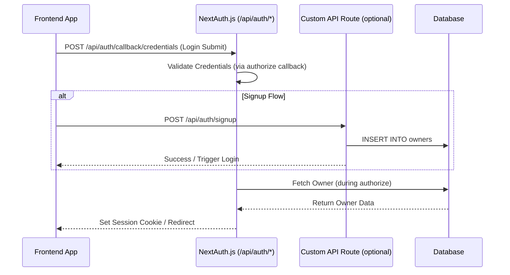

# Backend Architecture

## Service Architecture

### Serverless Architecture

Use Vercel Functions via **Next.js API Routes**.

  * **Function Organization:** Place handlers in `apps/web/src/pages/api/`.
    ```text
    apps/web/src/pages/api/
    ├── auth/
    │   └── [...nextauth].ts
    ├── owner/
    │   └── subdomain.ts
    ├── products/
    │   └── index.ts
    └── webhook/
        └── messenger.ts # Chatbot webhook
    ```
  * **Function Template:** Standard Next.js API route handler with TypeScript.
    ```typescript
    // Example: apps/web/src/pages/api/products/index.ts
    import type { NextApiRequest, NextApiResponse } from 'next';
    // ... imports ...
    export default async function handler(req: NextApiRequest, res: NextApiResponse) {
      // Check auth for POST
      if (req.method === 'POST') { /* Handle Add Product */ }
      else if (req.method === 'GET') { /* Handle Get Products */ }
      else { /* Method Not Allowed */ }
    }
    ```

## Database Architecture

### Schema Design

Use SQL DDL from Section 9. Manage via migration tool.

```sql
-- CREATE TABLE owners (...);
-- CREATE TABLE products (...);
```

### Data Access Layer

Use Supabase client library (`@supabase/supabase-js`). Recommend simple repository functions in `apps/web/src/lib/db.ts`.

```typescript
// Example: apps/web/src/lib/db.ts
import { createClient } from '@supabase/supabase-js';
// ... Supabase client setup ...
export const getProductsByOwnerId = async (/* ... */): Promise<Product[]> => { /* ... */ };
// ... other DB functions ...
```

## Authentication and Authorization

### Auth Flow

Use **NextAuth.js** Credentials Provider for email/password signup and login.



### Middleware/Guards

Use NextAuth.js middleware (`apps/web/middleware.ts`) for `/admin/*` routes. Check session in API routes needing auth.

```typescript
// Example: API Route Auth Check
import { getServerSession } from "next-auth/next"
// ...
const session = await getServerSession(req, res, authOptions);
if (!session) { return res.status(401).json(/* ... */); }
// Proceed...
```

-----
