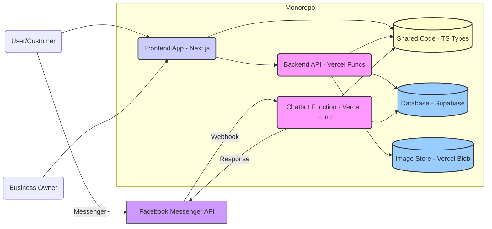

# Components

## Component List

### Frontend App (`apps/web`)

  * **Responsibility:** Handles all user-facing interactions (public showcase, owner admin dashboard). Renders UI, manages state, interacts with backend API. Built with Next.js.
  * **Key Interfaces:** Renders HTML, makes HTTP requests to `/api/*`.
  * **Dependencies:** Backend API, Shared Packages.
  * **Technology Stack:** Next.js, React, TypeScript, UI Library, Tailwind CSS, Zustand/Context, NextAuth.js.

### Backend API (`apps/web/pages/api` or `apps/api`)

  * **Responsibility:** Handles business logic via serverless functions (auth, owner accounts, product CRUD, image upload coordination). Implemented as Next.js API Routes.
  * **Key Interfaces:** Exposes RESTful HTTP endpoints, interacts with DB and Image Storage.
  * **Dependencies:** Database, Image Storage, Shared Packages.
  * **Technology Stack:** Node.js, TypeScript, Next.js, Supabase Client.

### Chatbot Function (`apps/web/pages/api/webhook/messenger.ts`)

  * **Responsibility:** Handles Facebook Messenger webhooks, parses messages, queries DB, sends responses. Implemented as a Vercel Function (via Next.js API Route).
  * **Key Interfaces:** Receives POST from Facebook, Sends POST to Messenger API, Interacts with DB.
  * **Dependencies:** Database, Facebook Messenger API, Shared Packages.
  * **Technology Stack:** Node.js, TypeScript, Facebook SDK/API client.

### Database (`External Service - Supabase`)

  * **Responsibility:** Persists Owner and Product data. Enforces schema.
  * **Key Interfaces:** SQL interface (PostgreSQL).
  * **Dependencies:** None.
  * **Technology Stack:** PostgreSQL (via Supabase).

### Image Storage (`External Service - Vercel Blob / Supabase Storage`)

  * **Responsibility:** Stores uploaded product images, provides URLs.
  * **Key Interfaces:** HTTP API for uploads/downloads.
  * **Dependencies:** None.
  * **Technology Stack:** Vercel Blob or Supabase Storage.

### Shared Code (`packages/shared`)

  * **Responsibility:** Contains shared TypeScript types (`Owner`, `Product`).
  * **Key Interfaces:** Exports TypeScript types.
  * **Dependencies:** None.
  * **Technology Stack:** TypeScript.

## Component Diagrams

-----
