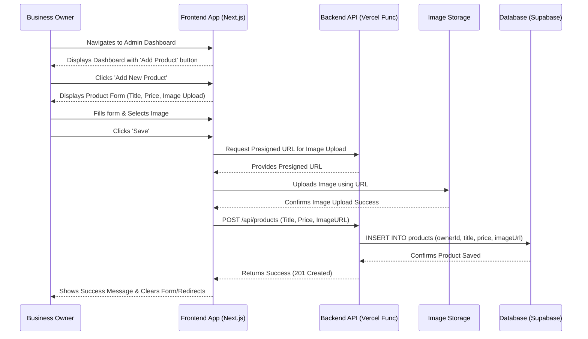
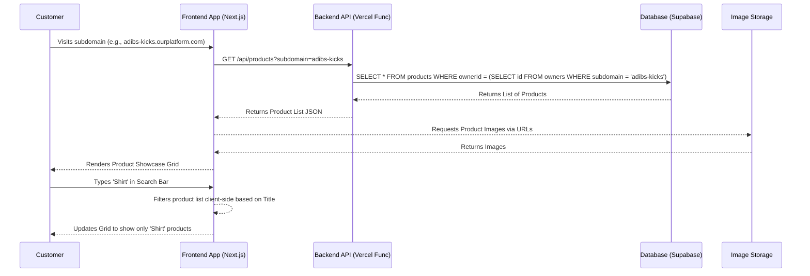
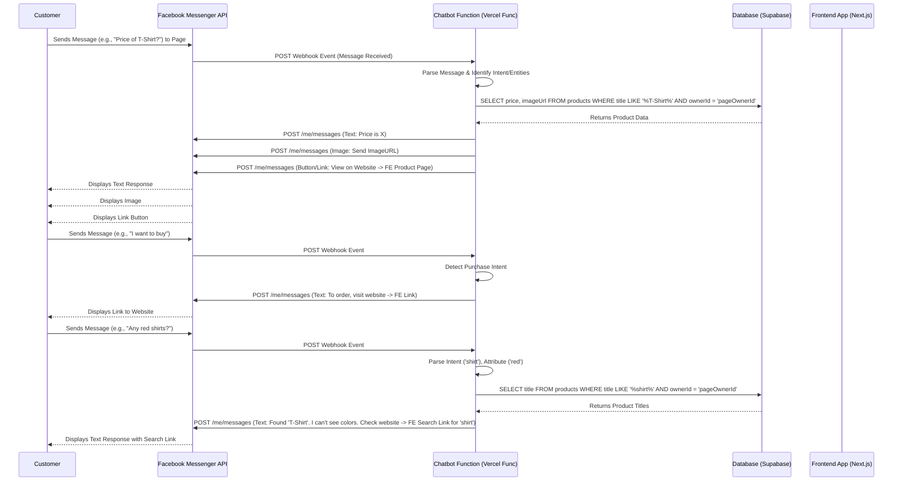

# Core Workflows

## Workflow 1: Owner Adds New Product (Stories 1.4, 1.5)

## Workflow 2: Customer Views Showcase & Searches (Stories 1.6, 1.7)

## Workflow 3: Customer Interacts with Chatbot (Stories 2.2, 2.3, 2.4)

-----
