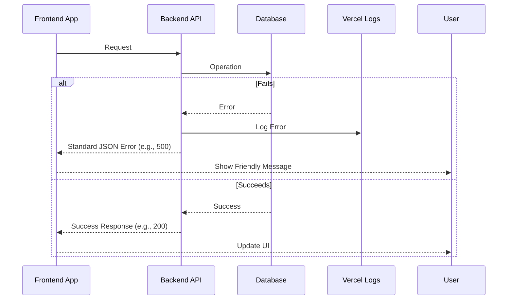

# Error Handling Strategy

## Error Flow

Catch errors -\> Log backend -\> Return standard JSON error -\> Show user-friendly FE message.



## Error Response Format

```typescript
interface ApiErrorResponse {
  error: {
    code: string; // e.g., 'INTERNAL_SERVER_ERROR'
    message: string; // User-friendly or generic message
    details?: Record<string, any>; // Optional validation details
  };
}
```

## Frontend Error Handling

  * Wrap API calls in try/catch in service layer/components.
  * Use `useState` to display friendly error messages. Avoid showing technical details.
  * Consider global React Error Boundary.

## Backend Error Handling

  * Wrap API route logic in try/catch.
  * Use helper to return standard `ApiErrorResponse` with correct status codes (4xx/5xx).
  * Log detailed errors server-side via `console.error`. Return generic messages for 5xx errors.

-----
