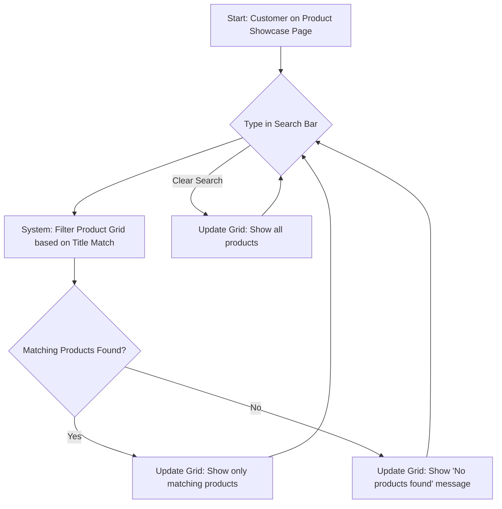

# User Flows

## Add New Product Flow

**User Goal:** For the business owner to easily add a new product (Title, Price, Image) to their showcase.

**Entry Points:** The "Product Dashboard" screen within the Admin Area.

**Success Criteria:** A new product record is successfully created in the database, and the owner receives confirmation.

**Flow Diagram:**

```mermaid
graph TD
    A[Start: Owner on Product Dashboard] --> B{Click 'Add New Product' button};
    B --> C[Show Simple Product Form (Title, Price, Image Upload)];
    C --> D{Fill in Title};
    D --> E{Fill in Price};
    E --> F{Upload Image};
    F --> G{All fields valid?};
    G -- Yes --> H[Enable 'Save' button];
    G -- No --> C;
    H --> I{Click 'Save' button};
    I --> J[System: Upload Image to storage];
    J --> K[System: Save Product (Title, Price, ImageURL) to DB];
    K --> L[Show Success Message];
    L --> M[End: Return to Product Dashboard / Clear Form];
    I -- Error --> N[Show Error Message];
    N --> C;
```

**Edge Cases & Error Handling:**

  * What happens if image upload fails? (Should show an error, prevent saving).
  * What happens if database save fails? (Should show an error).
  * Input validation (e.g., price should be a number).

**Notes:** This flow must be extremely simple and intuitive for the non-technical owner, as per NFR1. The form could be a modal overlay or a separate page.

## Customer Product Search Flow

**User Goal:** For the end customer to quickly filter the product grid and find a specific product by its name.

**Entry Points:** The "Product Showcase" page (subdomain).

**Success Criteria:** The product grid updates in real-time to show only products whose titles match the search term.

**Flow Diagram:**



**Edge Cases & Error Handling:**

  * Search performance with a large number of products (though less critical for a prototype).
  * Handling of special characters or different languages in search terms (defer for prototype).

**Notes:** This interaction should feel instant (real-time filtering as the user types). The filtering logic is strictly based on the **Product Title**.

-----
